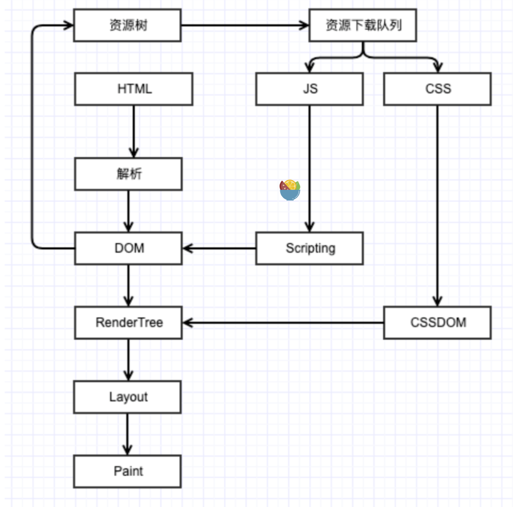

## 回流与重绘是什么

> **回流（reflow）** 和 **重绘（repaint）** 是前端开发中性能优化的重要概念，它们对前端开发者来说非常重要，因为它们直接影响网页的性能和响应速度。

- **回流（reflow）** : 回流又称为 **重排** ，指的是当 `页面布局`或 `DOM 元素的几何属性`（例如位置、大小）发生变化时，浏览器需要重新计算元素的几何属性，并重新布局整个页面。这是一个比较耗性能的操作，会导致页面重新渲染，因此应该尽量避免频繁的回流。
- **重绘（repaint）** : 指的是当 `DOM 元素的样式属性`（例如颜色、背景）发生变化时，浏览器会重新绘制被影响的元素。重绘不会影响布局，只会重新绘制元素的外观，因此比回流的性能开销要小。

浏览器渲染流程

基本原则就是 js 是单线程的，而浏览器是多进程的，每一个 tab 都有一个进程（多个空白 tab 标签会合并成一个进程），有单独的渲染引擎。

所以 html 解析顺序执行生成 dom 树。遇到 css 内联样式则由 css 渲染器构造 css 树，而 link 则是异步的。

css 树与 dom 树的建立是同步运行的，最后两者结合，渲染 dom 树。也就是说 dom 树是有解析和渲染两个阶段的。

css 加载不会阻塞 dom 树解析，但会阻塞 dom 树渲染，且 css 加载会阻塞 js 语句的执行。

css 等待 dom 树解析完成之后再渲染 dom 树更好。

再进行计算元素大小和位置，然后进行 paint 绘制。

## GUI 与 Js 的执行

GUI 渲染线程与 JS 引擎线程是互斥的，所以如果 JS 执行的时间过长，这样就会造成页面的渲染不连贯，导致页面渲染加载阻塞。

## link 和@import

@import 是 css 的语法规则，而 link 是 html 标签，link 可以同步加载，而 @import 会在页面加载完成后被加载。即@import 相对于异步，在 dom 树渲染完成之后再次加载 css，导致重排

## 回流（重排）与重绘的 case

回流：

1. 页面首次渲染
2. 页面大小变化
3. 添加删除可见的 dom 元素
4. 修改 dom 元素的尺寸，位置，边距等。
5. 修改 dom 的内容
6. 激活 css 伪类
7. 查询浏览器页面的一些属性，例如 clientwidth 等属性。

重绘就包括 css 的一些属性变化，包括 fontsize，color，text-align，boxshow，linear-gradient，transform，transition 等等类似的属性。

对于回流，浏览器有类似引擎策略，引擎在一定时间内将重绘导致的操作存储在队列中，当到达阈值或者时间到了的时候将队列内的操作一一执行，但上述回流第七点，获取布局信息时会直接执行，因此避免第七点的 操作。

## 回流与重绘优化方案

1. 合并 css 更改。多次操作合并成一次操作，只会导致一次回流或者重绘。
2. dom 属性为 dispplay：none 时，对该 dom 操作不会引起重绘和重排。
3. 利用 js 创建完整的 dom 之后再添加到 dom 树内，只有一次回流。同样还可以 replaceChild。
4. absolute 和 fixed 会脱离文档流，一定程度上对他们的更改会减少回流的次数。
5. 缓存 offsetTop 和 clientWidth 等信息来减少回流。
6. 使用节流和防抖来减少 scroll 和 resize 等操作引发回流的次数。
7. 动态渲染少用 table 布局。
8. 对于一些动画，能用 css3 替换 js 动画。可以触发硬件加速，而不是将 js 需要 GPU。

## 动画优化

动画需要频繁的操作dom，因此可以是动画的节点脱离文档流，absolute或者fixed，这样就不会影响到页面了。

## 图片的懒加载

其实vue的组件也有懒加载，也就是按需加载。

而图片的懒加载，通过data-xxx属性来实现，data属性存储图片的路径，当需要加载图片时将data值赋值给src属性即可完成加载。

解决不立即加载简单，重点是判断哪些img需要加载，一般是滚动列表，判断图片的height是否在屏幕内。

## documentFragment

一个html标签，文档片段接口，也是框架里fragment组件的原理，它与dom最大的区别是插入时不会触发dom树的重新渲染，也就是回流。

插入fragment不插入自身，而是插入所有的子节点，但不会触发重绘。因此可以将节点装载到fragment下，然后一次性插入节点，提高性能。

## 异步加载js

script标签的defer和async的属性。区别是async在脚本加载完毕执行，也就是会打断html解析。而defer在dom加载完毕执行，

以及动态创建script，和juqery方式。

## js和css动画

js动画：复杂，逐帧执行，可以进行复杂的控制，开始，暂停，同时由于js是异步的，可能阻塞丢帧。占用资源大。

可以制作复杂的动画，且兼容性好。

css3（[补间动画](https://www.zhihu.com/search?q=%E8%A1%A5%E9%97%B4%E5%8A%A8%E7%94%BB&search_source=Entity&hybrid_search_source=Entity&hybrid_search_extra=%7B%22sourceType%22%3A%22answer%22%2C%22sourceId%22%3A1627856428%7D)）:确定起始和结束状态，比较简单。两个关键帧之间帧的内容由[Composite线程](https://www.zhihu.com/search?q=Composite%E7%BA%BF%E7%A8%8B&search_source=Entity&hybrid_search_source=Entity&hybrid_search_extra=%7B%22sourceType%22%3A%22answer%22%2C%22sourceId%22%3A1627856428%7D)自动生成

## 为什么--浏览器会单独开一个线程跑css的动画图层

防止css完成后js操作导致回流与重绘

## 节流防抖

> 防抖：合并操作，一定时间内只执行最后一次操作，搜索框输入，只需要最后一次输入进行搜索，窗口调整完后计算窗口。

> 节流：短时间内只触发一次操作，滚动加载，底部，多拉只加载一个，搜索框联想，停了一段时间才联想。

> 节流不管事件触发有多频繁，都会保证在规定时间内一定会执行一次真正的事件处理函数，而防抖只是在最后一次事件后才触发一次函数。

区别就是节流会在t内执行，而防抖会超过t，只要一直触发。

## 优化项目中的图片

1. 不用图片：部分修饰类的图片可以用css替代，
2. 移动端，屏幕很小，不加载原图，而是cdn加载，可以计算出适配屏幕的宽度，然后直接**请求相应裁剪好的图片**
3. 小图用base64格式。
4. 将多个图标文件整合到一个图片中（雪碧图）。
5. 选择正确的图片格式：能显示WebP格式的浏览器用WebP。因为WebP具有更好的图像压缩算法，更小的体积且肉眼无差异的图像质量，缺点就是兼容性不好。小图用png，图标类用SVG，照片用JPEG

## webpack前端优化

1. 删除多余的注释和代码，简化代码，压缩css和js，利用webpack的loader。
2. 利用cdn加速，将静态资源的路径改为 cdn上对应的路径。可以利用webpack对于output参数和各loader的publicPath参数来修改路径
3. Tree Shaking：将代码中永远不会走到的代码删除，可以通过启动webpack时追加参数-optimize-minimize实现。
4. code Splitting：将代码按路由维度或组件分块，需要按需加载，同时可以充分利用浏览器缓存。

## 简述前端性能优化

页面内容方面：

1. 通过文件合并，css雪碧图（就是在一个容器内存放多个图片的图标），以及base64等方式减少http请求的次数，避免过多请求 造成等待的情况。
2. 通过dns缓存的方式减少dns的查询方式
3. 通过设置缓存策略，对常用的不变的资源进行缓存
4. 通过延迟加载的方式，减少首屏加载时需要请求的资源。延迟加载的资源等到用户需要查看时再进行加载
5. 通过用户的行为，对某些资源进行预加载，提高用户需要访问资源时的响应速度。

## 服务器方面

1. 提高cdn服务，提高用户对于资源请求时的响应速度。
2. 服务器自用Gzip，deflate等方式对传输的资源进行压缩减少文件的体积。
3. 尽可能减少cookie的体积，且提高将静态资源分配到其他域名下，避免对静态资源的请求时携带不必要的cookie。
