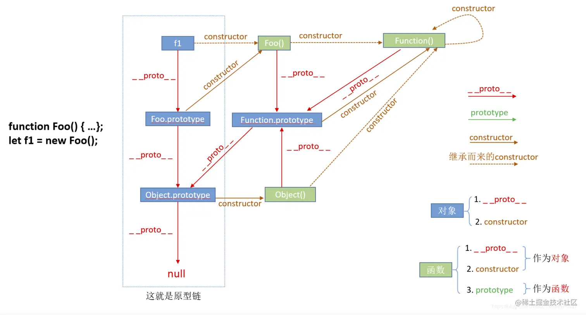

# js 基础文档

## event 对象的获取

```
 constfun= (e) => {
 console.log(e);
 // 这种方式拿不到e
 }
```

拿到 e 的方式基本上就是通过选择器或者 jquery 拿到节点后再绑定事件可以拿到 e。

```
        document.getElementById("btn").onclick = (e) => {
            // e.stopPropagation()
            console.log(e);
        }
```

## 事件的捕获与冒泡

捕获是指从 window 对象开始向下捕获事件，而冒泡是从事件元素向上冒泡

## 阻止冒泡

具体代码在: [propagation.html](./test/propagation.html)

`event.stopPropagation() `能够阻止事件冒泡，`event.preventDefault `阻止默认事件，一般是指页面跳转这个默认行为，例如 a，button，但是会冒泡。当然也可以用 ` return false`，他同样四阻止默认行为，吧阻止冒泡，再 jquery 中 `retur false`也会阻止冒泡

## 原型与原型链

具体代码在：[prototype.js](./prototype.js)

> 对象有原型链和 constructor，函数有原型链和 constructor 和一个额外的 prototype

Constructor 指向构造对象的函数，原型链指向原型对象

> 函数的原型对象是通过函数构造出来的，也就是原型对象的 constructor 指向函数

> 原型也是一个对象，也有 constructor 和原型链，因此可以往上递归或者遍历寻找

代替原型链**proto**的是 Object.getPrototyprOf



## 实现继承

```
d// 完美继承 --  寄生组合式继承

function Fun() {
    this.sex = "男"
}

Fun.prototype.fname = "ss"


function extend(supFun, sonFun) {
    let prototype = Object(supFun.prototype)   //创建对象  以父函数的原型对象创建一个对象，他能够拥有父函数的原型对象上的所有属性
    prototype.constructor = supFun;              // 再将这个对象的构造函数指向父函数
    sonFun.prototype = prototype               // 最后将子函数的原型等于创建的对象
    // 总的来说就是等价于sonFun的原型是通过new supFun得到的一个对象，并且原型链生成
}

function Son3() {
    Fun.call(this)
    console.log("s3 son constructoe");
}
extend(Fun, Son3)
let s3 = new Son3()
console.log(s3.fname);   //  可以读取父函数原型上的值   s3对象上没找到，然后找原型链上，即Son3.prototype  然后找到了
console.log(s3.sex);     //  通过构造函数继承，可以读取公有变量
```

这样能够满足完美继承，1.原型链指向父函数，也就是可以读取原型链上的值 2.子函数的构造函数指向父函数 3. 可以读取父函数内的共享变量

具体在[extend.js](./extend.js)
